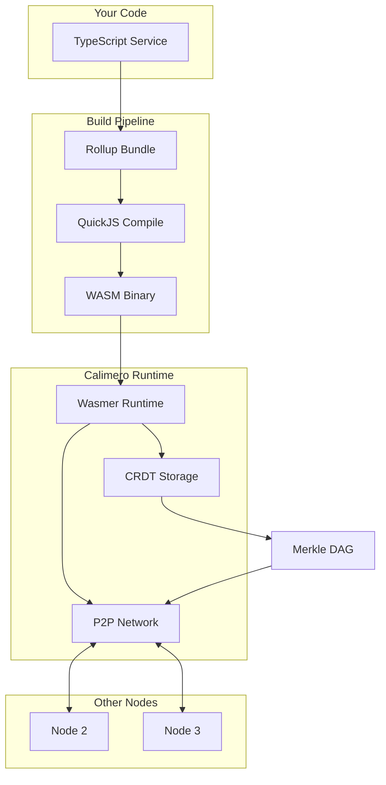
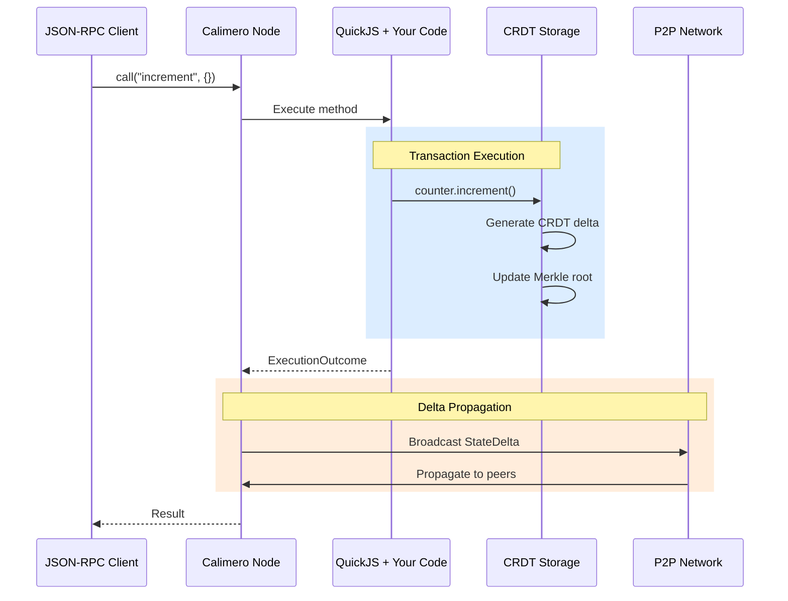
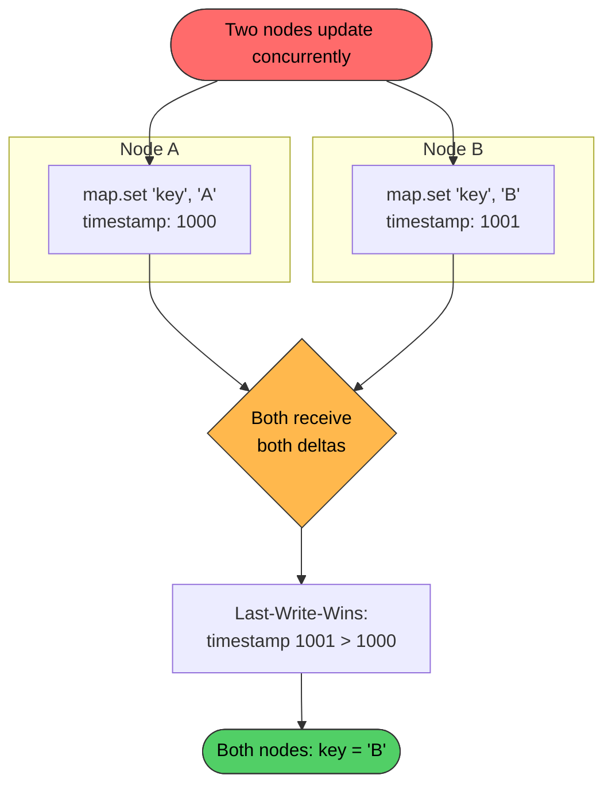

# Calimero JavaScript SDK

Build stateful peer-to-peer services for the Calimero Network using TypeScript. The SDK compiles your service bundle to WebAssembly, runs it inside QuickJS, and keeps state in sync with Calimero's CRDT layer.

Complex nested structures like `Map<K, Set<V>>` and `Map<K, Map<K2, V2>>` work seamlessly with automatic change propagation - no manual re-serialization required.

> ⚠️ **Experimental:** the JavaScript SDK is still evolving (mergeable metadata, host-side conflict resolution, and private storage APIs are in active development). Expect breaking changes while we stabilise the toolchain.

---

## Quick Links

- 📘 [Documentation index](docs/README.md) – roadmap of all guides
- 📚 **Docs** – see `docs/` for detailed guides:
  - [Getting Started](docs/getting-started.md)
  - [Architecture](docs/architecture.md)
  - [Collections & CRDTs](docs/collections.md)
  - [Mergeable (experimental)](docs/mergeable-js.md)
- 🧪 **Examples** – full services under `examples/`:
  - `examples/counter`
  - `examples/kv-store`
  - `examples/team-metrics`
  - `examples/private-data`
- ⚙️ **Workflows** – each example has a `workflows/*.yml` Merobox scenario you can run with `merobox bootstrap run …`.
- 🛠️ **Packages**
  - `packages/sdk` (`@calimero-network/calimero-sdk-js`) – decorators, collections, env bindings
  - `packages/cli` (`@calimero-network/calimero-cli-js`) – Rollup ➜ QuickJS ➜ WASM toolchain
- 🤖 **[AGENTS.md](AGENTS.md)** – AI/agent coding assistant reference

---

## Architecture Overview



## WASM Execution Flow



---

## Getting Started

### Prerequisites

- Node.js 18+ with WASI support
- `pnpm` ≥ 8 (or npm/yarn)
- Access to a Calimero node (`merod`) and CLI (`meroctl`)

> **Note for Windows users:** Building/compiling is not supported natively on Windows. Use WSL (Windows Subsystem for Linux) instead. See [WINDOWS_SETUP.md](WINDOWS_SETUP.md).

### Install

```bash
pnpm add @calimero-network/calimero-sdk-js
pnpm add -D @calimero-network/calimero-cli-js typescript
```

#### Build Dependencies (QuickJS, WASI-SDK, Binaryen)

The CLI package (`@calimero-network/calimero-cli-js`) includes a `postinstall` hook that automatically downloads the required build toolchain:

- **QuickJS** – compiles JavaScript to C bytecode
- **WASI-SDK** – compiles C to WebAssembly
- **Binaryen** – optimizes and strips WASI imports from the final `.wasm`

**Important caveats:**

1. **Scripts must be enabled.** If you run `pnpm install --ignore-scripts` or have `ignore-scripts=true` in your `.npmrc`, the postinstall hook won't run. Re-run install with scripts enabled:

   ```bash
   pnpm install --ignore-scripts=false
   ```

2. **Platform support.** The build toolchain supports macOS and Linux (x64 and arm64). Windows users must use WSL.

3. **Manual installation.** If the postinstall fails, you can manually trigger the dependency download:
   ```bash
   pnpm --filter @calimero-network/calimero-cli-js run install-deps
   ```

### Minimal Service

```typescript
import { State, Logic, Init, View, createCounter } from '@calimero-network/calimero-sdk-js';
import { Counter } from '@calimero-network/calimero-sdk-js/collections';

@State
export class CounterState {
  value: Counter = createCounter();
}

@Logic(CounterState)
export class CounterLogic extends CounterState {
  @Init
  static init(): CounterState {
    return new CounterState();
  }

  increment(): void {
    this.value.increment();
  }

  @View()
  getCount(): bigint {
    return this.value.value();
  }
}
```

Build & deploy the service bundle:

```bash
npx calimero-sdk build src/index.ts -o build/service.wasm
meroctl --node-name <NODE> app install \
--path build/service.wasm \
  --context-id <CONTEXT_ID>
```

Call it:

```bash
meroctl --node-name <NODE> call \
  --context-id <CONTEXT_ID> \
--method increment
meroctl --node-name <NODE> call \
  --context-id <CONTEXT_ID> \
--method getCount
```

---

## Core Concepts

### CRDT Collections

All state in Calimero apps uses **CRDTs** (Conflict-free Replicated Data Types) for automatic conflict resolution:

| Collection      | Use Case                         | Conflict Resolution               |
| --------------- | -------------------------------- | --------------------------------- |
| `Counter`       | Distributed counting             | Sum across all nodes              |
| `UnorderedMap`  | Key-value storage                | Last-Write-Wins per key           |
| `UnorderedSet`  | Unique membership                | Last-Write-Wins per element       |
| `Vector`        | Ordered lists                    | Position-based merge              |
| `LwwRegister`   | Single values                    | Timestamp-based LWW               |
| `UserStorage`   | User-owned signed data           | Signature-verified writes         |
| `FrozenStorage` | Immutable content-addressed data | Content-addressable (no conflict) |

### CRDT Conflict Resolution



### Concepts Quick Reference

| Topic                          | Summary                                                                                                                                   | Where to learn more                                                                |
| ------------------------------ | ----------------------------------------------------------------------------------------------------------------------------------------- | ---------------------------------------------------------------------------------- |
| State & Logic                  | `@State` defines persisted data, `@Logic` exposes methods, `@Init` seeds the first snapshot.                                              | [docs/collections.md](docs/collections.md#best-practices-by-type)                  |
| Views vs Mutations             | Decorate read-only entry points with `@View()` to skip persistence.                                                                       | [docs/collections.md](docs/collections.md#handles-not-deep-copies)                 |
| CRDT collections               | `UnorderedMap`, `UnorderedSet`, `Vector`, `Counter`, `LwwRegister`. Nested collections work seamlessly with automatic change propagation. | [docs/collections.md](docs/collections.md)                                         |
| Private storage                | Use `createPrivateEntry()` for node-local secrets; stored via `storage_write`, never broadcast.                                           | [docs/getting-started.md](docs/getting-started.md#private-storage-node-local-data) |
| Mergeable state (experimental) | `@Mergeable()` records merge hints. Full conflict resolution still requires host support.                                                 | [docs/mergeable-js.md](docs/mergeable-js.md)                                       |
| Architecture                   | TypeScript → Rollup → QuickJS → WASI → Calimero runtime.                                                                                  | [docs/architecture.md](docs/architecture.md)                                       |

---

## Examples & Workflows

| Example                                          | Highlights                                          | Workflow                                              |
| ------------------------------------------------ | --------------------------------------------------- | ----------------------------------------------------- |
| `examples/counter`                               | Basic `Counter` CRDT                                | `examples/counter/workflows/counter-js.yml`           |
| `examples/kv-store`                              | KV store with `UnorderedMap`                        | `examples/kv-store/workflows/kv-store-js.yml`         |
| `examples/team-metrics`                          | Nested CRDTs, events, mergeable structs             | `examples/team-metrics/workflows/team-metrics-js.yml` |
| `examples/private-data`                          | Public vs node-local storage (`createPrivateEntry`) | `examples/private-data/workflows/private-data-js.yml` |
| `examples/kv-store-with-user-and-frozen-storage` | `UserStorage` and `FrozenStorage` examples          | See workflows in example directory                    |

Run a workflow:

```bash
merobox bootstrap run examples/team-metrics/workflows/team-metrics-js.yml --log-level=trace
```

---

## Development & Testing

> **Windows users:** Run these commands in WSL, not PowerShell/CMD.

```bash
# Install dependencies
pnpm install

# Build SDK & CLI packages
pnpm --filter @calimero-network/calimero-sdk-js build
pnpm --filter @calimero-network/calimero-cli-js build

# Run unit tests
pnpm --filter @calimero-network/calimero-sdk-js exec jest --runInBand
```

Useful docs:

- [docs/troubleshooting.md](docs/troubleshooting.md) – common issues
- [docs/events.md](docs/events.md) – event patterns
- [docs/api-reference.md](docs/api-reference.md) – generated API listings

---

## Comparison with Rust SDK

The JavaScript SDK provides equivalent functionality to the [Rust SDK](https://github.com/calimero-network/calimero/tree/main/crates/sdk):

| TypeScript           | Rust                              |
| -------------------- | --------------------------------- |
| `@State`             | `#[app::state]`                   |
| `@Logic(StateClass)` | `#[app::logic]`                   |
| `@Init`              | `#[app::init]`                    |
| `@View()`            | Method without `&mut self`        |
| `Counter`            | `Counter`                         |
| `UnorderedMap<K, V>` | `UnorderedMap<K, LwwRegister<V>>` |
| `env.log()`          | `app::log!()`                     |
| `emit(event)`        | `app::emit!(event)`               |

Both SDKs:

- ✅ Run on the same network
- ✅ Sync state via CRDTs
- ✅ Emit/receive events
- ✅ Call each other (xcall)

---

## Support & Feedback

- Issues & feature requests: [GitHub Issues](https://github.com/calimero-network/calimero-sdk-js/issues)
- Community chat: [Discord](https://discord.gg/calimero)
- Platform docs: [docs.calimero.network](https://docs.calimero.network)

---

## License

Apache-2.0
